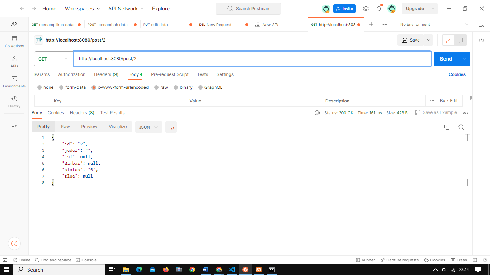
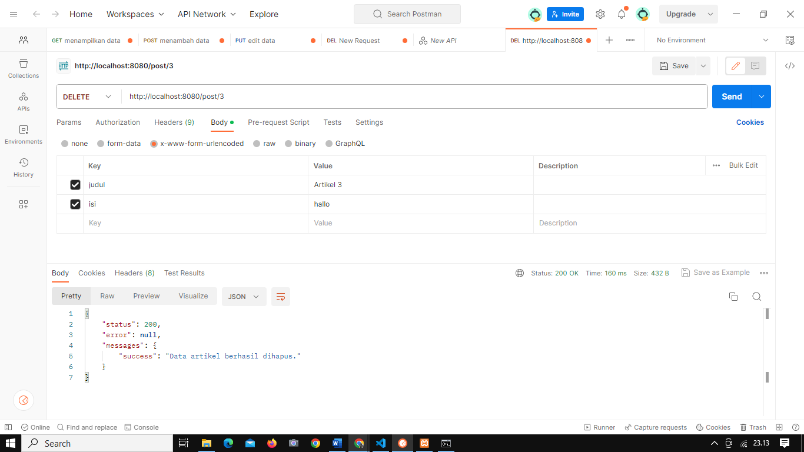

# Tugas Pemrograman Web 2
# Praktikum 12
## Profile
<body>
    <table border="1">
        <tr>
            <th> Nama</th>
            <th>NIM</th>
            <th>Kelas</th>
        </tr>
        <tr>
            <td>Rizal Pringgandani</td>
            <td>312110151</td>
            <td>TI.21.A2</td>
        </tr>
    </table>
</body>

## Intruction
Melanjutkan praktikum sebelumnya pada repository dengan nama **`Lab11Web`**

## Output

## Menampilkan data

## Menampilkan data by id

## menambahkan data

## Mengubah data

## Menghapus data
